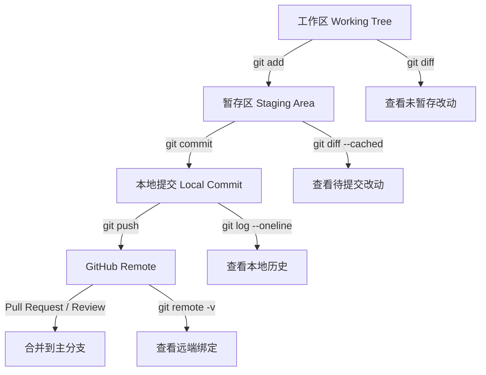
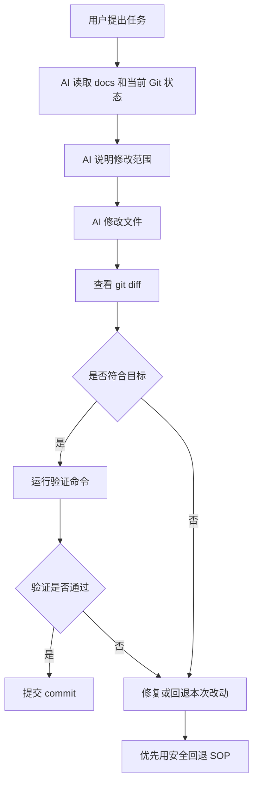

# Git / GitHub 安全 SOP

本文定义 STDAS 使用 Git、GitHub 和 AI Agent 生成代码时的版本控制安全流程。目标是让不熟悉 Git 的维护者也能知道当前处于哪个状态、下一步是否危险、以及如何在 AI 生成偏离目标时安全回退。

## 当前原则

- Git 是本地版本历史；GitHub 是远端托管平台。项目能提交到 Git，不代表已经绑定 GitHub。
- `git remote -v` 没有输出时，说明当前仓库没有配置 GitHub remote，不能直接 `git push`。
- `git config user.name` 和 `git config user.email` 只表示本地提交作者信息，不表示已经登录 GitHub。
- Codex 绑定 GitHub 账户、GitHub CLI 登录、以及本地仓库配置 `origin` remote 是三件不同的事。
- `gh auth status`、GitHub Desktop / VS Code 登录状态或 Codex GitHub connector 只能证明对应工具可访问 GitHub；本地仓库是否能 push 仍以 `git remote -v` 和实际 remote 权限为准。
- AI Agent 不得把用户对 Git 的猜测当成正确操作，必须先解释风险、显示当前状态、再执行。

## AI 执行门禁

用户要求提交、推送、回退、换分支或绑定 GitHub 时，AI Agent 必须先进入 Git 安全诊断模式。该模式只允许读取状态，不允许修改文件、提交、推送或回退。

诊断模式必须输出：

```text
1. 当前分支
2. 当前 remote
3. 当前提交作者
4. 工作区是否干净
5. 未提交改动摘要
6. 是否存在未跟踪文件
7. 是否存在删除文件
8. 是否存在高风险命令需求
9. 推荐的下一步 SOP
```

只有完成诊断并给出分组计划后，AI Agent 才能进入提交或绑定阶段。

### 提交前门禁

执行 `git add` 或 `git commit` 前，AI Agent 必须给出提交计划：

```text
Commit subject:
Commit type/scope:
包含文件:
排除文件:
验证命令:
风险说明:
```

如果工作区同时包含代码、文档、设计图片、依赖锁文件、移动文件和删除文件，AI Agent 必须先按变更意图分组说明。提交拆分优先采用中大型项目常用的四个判断：

- Atomic change：一个 commit 是否只表达一个可理解的行为、功能切片或维护动作。
- Reviewability：reviewer 是否能在一个 diff 中看清原因、实现和影响范围。
- Revertability：如果这个 commit 需要回退，是否会把仍然正确的无关工作一起回退。
- Bisectability：每个 commit 落地后是否仍应保持可构建、可测试或至少不破坏主线诊断。

属于同一功能切片且互相解释同一实现的 code、test、configuration、runtime assets 和 documentation changes 可以合并到一个 commit。无关草稿、生成物、不同功能、不同风险等级、不同回退生命周期的内容必须拆分提交。混合提交必须在提交计划和 commit body 中清楚标注 Code / Docs / Validation 范围；不得为了省事使用 `git add .` 一次性提交全部。

### 推送前门禁

执行 `git push` 前必须确认：

```bash
git remote -v
git branch --show-current
git log --oneline --decorate -5
```

如果没有 remote，AI Agent 只能说明“Codex 已绑定 GitHub 账户，但当前本地仓库还没有绑定 GitHub remote”，不得声称可以直接 push。

### 回退前门禁

执行任何回退前必须先判断回退类型：

```text
未提交改动回退
已提交未推送回退
已推送提交回退
误提交文件移除
错误分支修复
```

AI Agent 必须优先选择可审计、可恢复的方式，例如 `git revert` 或创建修复 commit。除非用户在看到影响范围后再次明确确认，不得执行改写历史或删除文件的命令。

## 状态结构图



## 标准工作流

每次让 AI Agent 生成或修改代码前，先建立可恢复边界。多人协作时默认使用短生命周期 feature branch + Pull Request；只有维护者明确要求且仓库允许时，才直接推送到主分支。

```text
1. 查看状态
2. 明确任务范围
3. 创建或确认安全分支
4. 让 AI 修改
5. 查看 diff
6. 运行验证
7. 提交本地 commit
8. 推送到 GitHub
9. 需要时创建 PR
```

推荐命令：

```bash
git status
git branch --show-current
git log --oneline --decorate -5
```

如果当前工作区已经有未提交改动，必须先判断它们属于谁、是否要保留、是否要拆分提交。AI Agent 不得擅自丢弃未提交改动。

## 首次绑定 GitHub SOP

首次推送前必须确认：

```bash
git remote -v
git config --get user.name
git config --get user.email
```

如果 `git remote -v` 没有输出，需要先在 GitHub 创建仓库，然后添加 remote：

```bash
git remote add origin https://github.com/<account>/<repo>.git
git remote -v
```

首次推送推荐使用显式 upstream：

```bash
git push -u origin master
```

如果项目改用 `main` 作为主分支，应先明确改名策略，再执行：

```bash
git branch -M main
git push -u origin main
```

不要在不理解远端状态时执行 `git push --force`。

## Codex GitHub 绑定说明

如果用户已经在 Codex 中绑定 GitHub 账户，AI Agent 可以在有对应工具能力时读取 GitHub repository、issue、pull request 或创建 PR。但是这不自动完成以下事情：

- 不会自动给本地仓库添加 `origin`。
- 不会自动决定 GitHub 仓库名称。
- 不会自动把本地 `master` 改成 `main`。
- 不会自动让 `git push` 成功。
- 不会替代提交前的 diff 审查和验证。

因此，即使 Codex 已绑定 GitHub，首次推送仍需要本地仓库 remote：

```bash
git remote add origin https://github.com/<account>/<repo>.git
git remote -v
git push -u origin <branch>
```

如果使用 Codex GitHub connector 创建 PR，也必须先确保本地 commit 已经 push 到对应 GitHub repository 和 branch。

## AI 生成代码 SOP



AI Agent 在修改后必须报告：

- 修改了哪些文件。
- 是否有新增、删除、移动文件。
- 是否有未处理的无关改动。
- 执行了哪些验证命令。
- 如果没有验证，原因是什么。

## 安全回退 SOP

回退前必须先回答三个问题：

1. 要回退的是“未提交改动”、某一个 commit，还是已经 push 到 GitHub 的提交？
2. 是否有其他人或其他工具的改动混在一起？
3. 是否需要保留当前失败尝试作为备份？

### 回退未提交改动

先查看：

```bash
git status
git diff
```

如果只想撤销某个文件的未提交修改，使用：

```bash
git restore <path>
```

如果只想取消暂存但保留文件内容，使用：

```bash
git restore --staged <path>
```

### 回退已经提交但还没有 push 的 commit

优先使用新 commit 修正，除非明确要重写本地历史。

如果确实要回到上一个 commit，同时保留文件改动：

```bash
git reset --soft HEAD~1
```

如果要取消 commit 但保留未暂存文件：

```bash
git reset --mixed HEAD~1
```

这些命令会改写本地历史。AI Agent 执行前必须再次确认目标 commit 和影响范围。

### 回退已经 push 的提交

已经 push 到 GitHub 后，默认使用 `git revert`，不要改写公共历史：

```bash
git revert <commit>
git push
```

`git revert` 会新增一个反向提交，保留历史可审计性。

## 禁止默认执行的高风险命令

AI Agent 不得在没有明确解释和确认的情况下执行：

```bash
git reset --hard
git clean -fd
git clean -fdx
git checkout -- .
git restore .
git push --force
git push --force-with-lease
```

这些命令可能删除用户未提交工作、删除未跟踪文件或改写远端历史。即使用户要求“回退全部”，AI Agent 也必须先展示 `git status` 和影响范围，再给出更安全替代方案。

## 提交规范

STDAS 新提交采用主流 Conventional Commits 风格：

```text
<type>(<scope>): <中文摘要，专有名词可用英文>
```

常用 type：

- `feat`：新增用户可见能力或 API 能力。
- `fix`：修复 bug 或行为回归。
- `docs`：只修改文档。
- `test`：只新增或调整测试。
- `refactor`：不改变行为的代码结构调整。
- `chore`：维护性改动，例如 ignore、脚本、仓库配置。
- `build` / `ci`：构建系统或 CI 改动。
- `revert`：回退已提交变更。

拆分提交按变更意图，不机械按文件类型拆分。推荐做法：

- 同一功能切片或行为变更所需的 code、test、configuration、runtime assets、documentation 可以合并提交。
- 如果文档只是解释本次实现、记录契约或补验收，应随代码提交。
- 如果文档是独立方向调整、长期策略或可以单独回退，应拆成独立 `docs(scope): ...` 提交。
- 混合提交的 commit body 和 changelog 必须用 `Code:` / `Docs:` / `Validation:` 或等价结构标注范围。
- 涉及破坏性变更时使用 `!` 或 `BREAKING CHANGE:` footer。
- 历史 `C###` / `D###` 提交记录保持原样，后续不再把本地编号写入 commit subject。

Changelog 采用 Keep a Changelog 结构：`[Unreleased]` 下按 `Added`、`Changed`、`Deprecated`、`Removed`、`Fixed`、`Security` 分类记录用户可见变化、接口变化、维护规则变化和迁移说明。Changelog 不逐条复制 commit 日志；commit history 和 PR 描述负责保存实现细节、Code / Docs / Validation 范围。

推荐 commit subject：

```text
feat(auth): 打通登录页和最小会话链路
docs(git): 采用 Conventional Commits 提交规范
fix(api): 修正 auth/me 过期 token 错误码
test(auth): 补充登录失败契约测试
```

提交前检查：

```bash
git status
git diff --cached
```

不要把本地生成目录、截图、依赖目录或构建缓存提交进去，例如：

- `node_modules/`
- `target/`
- `frontend/web/dist/`
- `.swarm/`
- `reference-project/`

## 给新手维护者的最小命令集

日常只需要先掌握这些命令：

```bash
git status
git diff
git add <path>
git commit -m "<message>"
git log --oneline --decorate -5
git remote -v
git push
```

遇到回退、冲突、force push、reset、clean、rebase，不要直接猜命令。先要求 AI Agent 进入“Git 安全诊断模式”，只读检查状态并给出 SOP，不直接执行破坏性操作。
