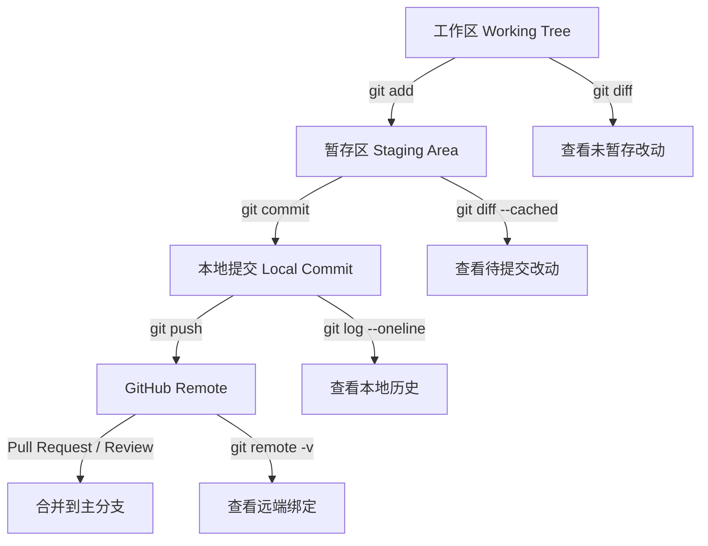
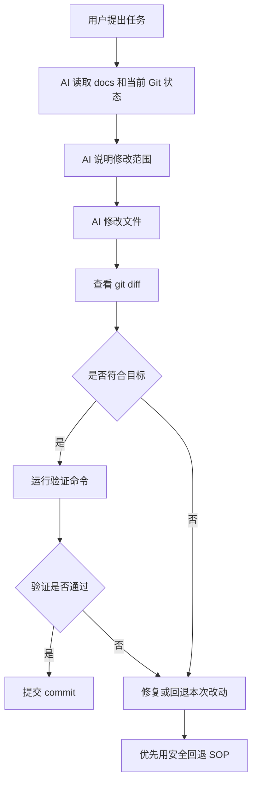

# Git / GitHub 安全 SOP

本文定义 STDAS 使用 Git、GitHub 和 AI Agent 生成代码时的版本控制安全流程。目标是让不熟悉 Git 的维护者也能知道当前处于哪个状态、下一步是否危险、以及如何在 AI 生成偏离目标时安全回退。

强制规则以 [Git Commit and Collaboration SPEC](../specs/git-commit-collaboration-spec.md) 为准；本文件是执行手册，负责把 SPEC 转换成日常操作步骤、诊断模板和场景决策。

## 当前原则

- Git 是本地版本历史；GitHub 是远端托管平台。项目能提交到 Git，不代表已经绑定 GitHub。
- `git remote -v` 没有输出时，说明当前仓库没有配置 GitHub remote，不能直接 `git push`。
- `git config user.name` 和 `git config user.email` 只表示本地提交作者信息，不表示已经登录 GitHub。
- Codex 绑定 GitHub 账户、GitHub CLI 登录、以及本地仓库配置 `origin` remote 是三件不同的事。
- `gh auth status`、GitHub Desktop / VS Code 登录状态或 Codex GitHub connector 只能证明对应工具可访问 GitHub；本地仓库是否能 push 仍以 `git remote -v` 和实际 remote 权限为准。
- AI Agent 不得把用户对 Git 的猜测当成正确操作，必须先解释风险、显示当前状态、再执行。
- `main` 是可集成主线。多人协作默认使用短生命周期 branch + Pull Request / Merge Request，合并主分支必须在验证和确认之后进行。
- 本 SOP 同样适用于 GitLab、Gitea、Azure Repos、自建 Git 服务等 remote；只是 PR 在不同平台可能叫 Merge Request。

## AI 执行门禁

用户要求提交、推送、回退、换分支或绑定 GitHub 时，AI Agent 必须先进入 Git 安全诊断模式。该模式只允许读取状态，不允许修改文件、提交、推送或回退。

诊断模式必须输出：

```text
1. 当前分支
2. 当前 remote
3. 当前提交作者
4. 工作区是否干净
5. 未提交改动摘要
6. 是否存在未跟踪文件
7. 是否存在删除文件
8. 是否存在高风险命令需求
9. 推荐的下一步 SOP
```

只有完成诊断并给出分组计划后，AI Agent 才能进入提交或绑定阶段。

当用户只说“我要提交 git”或“提交 github”时，AI Agent 的默认回复必须落到一个明确推荐：

```text
当前状态:
推荐方式:
是否需要临时/功能分支:
是否需要 push:
是否需要 PR/MR:
什么时候可以合并 main:
我准备包含:
我会排除:
需要跑的验证:
```

如果用户只说“提交 git”，默认含义是“生成本地 commit 并说明是否建议 push”，不是默认推送远端，更不是默认进入 `main`。

### 提交前门禁

执行 `git add` 或 `git commit` 前，AI Agent 必须给出提交计划：

```text
Commit subject:
Commit type/scope:
包含文件:
排除文件:
验证命令:
Changelog:
风险说明:
```

如果工作区同时包含代码、文档、设计图片、依赖锁文件、移动文件和删除文件，AI Agent 必须先按变更意图分组说明。提交拆分优先采用中大型项目常用的四个判断：

- Atomic change：一个 commit 是否只表达一个可理解的行为、功能切片或维护动作。
- Reviewability：reviewer 是否能在一个 diff 中看清原因、实现和影响范围。
- Revertability：如果这个 commit 需要回退，是否会把仍然正确的无关工作一起回退。
- Bisectability：每个 commit 落地后是否仍应保持可构建、可测试或至少不破坏主线诊断。

属于同一功能切片且互相解释同一实现的 code、test、configuration、runtime assets 和 documentation changes 可以合并到一个 commit。无关草稿、生成物、不同功能、不同风险等级、不同回退生命周期的内容必须拆分提交。混合提交必须在提交计划和 commit body 中清楚标注 Code / Docs / Validation 范围；不得为了省事使用 `git add .` 一次性提交全部。

### 推送前门禁

执行 `git push` 前必须确认：

```bash
git remote -v
git branch --show-current
git log --oneline --decorate -5
```

如果没有 remote，AI Agent 只能说明“Codex 已绑定 GitHub 账户，但当前本地仓库还没有绑定 GitHub remote”，不得声称可以直接 push。

### 回退前门禁

执行任何回退前必须先判断回退类型：

```text
未提交改动回退
已提交未推送回退
已推送提交回退
误提交文件移除
错误分支修复
```

AI Agent 必须优先选择可审计、可恢复的方式，例如 `git revert` 或创建修复 commit。除非用户在看到影响范围后再次明确确认，不得执行改写历史或删除文件的命令。

## 状态结构图



## 标准工作流

每次让 AI Agent 生成或修改代码前，先建立可恢复边界。多人协作时默认使用短生命周期 feature branch + Pull Request；只有维护者明确要求且仓库允许时，才直接推送到主分支。

```text
1. 查看状态
2. 明确任务范围
3. 创建或确认安全分支
4. 让 AI 修改
5. 查看 diff
6. 运行验证
7. 提交本地 commit
8. 推送到 GitHub
9. 需要时创建 PR
```

推荐命令：

```bash
git status
git branch --show-current
git log --oneline --decorate -5
```

如果当前工作区已经有未提交改动，必须先判断它们属于谁、是否要保留、是否要拆分提交。AI Agent 不得擅自丢弃未提交改动。

## 场景决策表

| 用户说法或当前状态 | 推荐动作 | 推送目标 | 是否进 `main` |
|--------------------|----------|----------|---------------|
| “提交 git”且工作区只有同一意图的改动 | 诊断后本地 commit；询问或建议是否 push | 默认当前 branch；如果在 `main` 且非平凡变更，先建 branch | 不直接进 |
| “提交 github”且当前在 `main` | 新建 `codex/<topic>` 或更明确的 topic branch，commit 后 push | `origin/<topic-branch>` | 通过 PR 合并 |
| “直接推 main” | 诊断并说明风险；仅维护者明确确认且改动低风险时执行 | `origin/main` | 已直接进，必须记录原因 |
| 非平凡代码、API、前端、架构、SPEC 或安全改动 | feature/fix/docs branch + draft PR | topic branch | review/checks 通过后进 |
| 纯文档 typo 或小的 ignore 规则 | 可以直接 commit；多人协作默认仍建议 PR | 低风险时可直接 main；否则 topic branch | 维护者确认后 |
| 同一功能切片的 code + tests + docs | 同一 commit 或同一 PR 内多个 commit，body 标注 Code/Docs/Validation | topic branch | PR 通过后 |
| 无关代码和文档策略混在一起 | 拆分 commit；必要时拆分 PR | 各自 topic branch | 分别合并 |
| 工作区有未跟踪截图、tmp、dist、target | 明确排除；只暂存目标文件 | 不推生成目录 | 不影响 main |
| 需要远端备份但还没准备 review | push topic branch；PR 标为 draft 或暂不创建 | topic branch | 不进 main |
| GitHub 以外 remote | 使用同样 branch/commit/验证规则；按平台创建 MR/PR | 对应 remote branch | MR/PR 通过后 |
| 已经创建 PR，后续还有同范围修改 | 继续 commit 到同一 branch 并 push，PR 自动更新 | 已有 PR branch | PR 最终合并 |
| PR 方向错误或用户不满意 | 在 PR branch 追加修正 commit，或关闭 PR 后重开 | topic branch | 暂不进 main |
| 已推送提交需要回退 | 默认 `git revert` 或修复 commit | 同一 branch 或新 revert branch | 通过 PR 合并 |
| 本地 commit 未 push，需要改 message 或拆分 | 可在确认后改写本地历史 | 未 push branch | 不影响 main |

## 分支选择标准动作

| 当前分支 | 变更类型 | 标准动作 |
|----------|----------|----------|
| `main` | 功能、修复、重构、API、前端页面、SPEC、架构文档 | `git switch -c codex/<topic>` 后提交 |
| `main` | 极小低风险文档 typo，维护者明确允许 | 可直接提交并推 `main`，但必须说明这是例外 |
| 已有 topic branch | 与当前 PR 同范围 | 继续使用当前 branch |
| 已有 topic branch | 与当前 PR 无关 | 不混入当前 PR；切回 `main` 更新后新建 branch |
| detached HEAD | 先创建 branch 保存当前状态，再继续 |
| 无 upstream | commit 后使用 `git push -u <remote> <branch>` 建立 tracking |

推荐 branch 命名：

```text
codex/<short-topic>
feat/<short-topic>
fix/<short-topic>
docs/<short-topic>
hotfix/<short-topic>
```

不要使用 `temp`、`test`、`new`、`update` 这种无法表达目标的分支名。临时探索也要表达目的，例如 `codex/login-auth-spike`。

## 推送与远端平台

推送前必须确认 remote URL 和目标分支：

```bash
git status --short --branch
git remote -v
git branch --show-current
git log --oneline --decorate -5
```

如果当前 branch 已有 upstream，可以再检查本地和 upstream 的领先/落后关系：

```bash
git rev-list --left-right --count HEAD...@{upstream}
```

如果当前 branch 没有 upstream，使用：

```bash
git push -u origin <branch>
```

GitHub 优先使用 GitHub connector 或 `gh` 创建 draft PR。GitLab、Gitea、Azure Repos 或自建 Git 服务按同样分支策略执行；如果没有平台 CLI 或 connector，AI Agent 必须报告已推送的 remote branch，并给出手动创建 MR/PR 的目标 base/head。

多个 remote 同时存在时，不能默认全部推送。必须说明：

```text
目标 remote:
目标 branch:
是否 fork:
是否 upstream:
是否需要跨仓库 PR/MR:
```

## PR/MR 生命周期

| 阶段 | 标准动作 |
|------|----------|
| Draft | 代码或文档已推送，但仍需要用户确认、视觉验收、方向确认或 CI 补齐 |
| Ready for review | 变更范围稳定，本地验证完成，PR/MR 描述完整 |
| Review changes requested | 追加 commit 修正，避免改写已共享历史 |
| Approved / checks passed | 可以由维护者合并，或由 AI Agent 在用户明确要求时合并 |
| Merged | 删除 topic branch，必要时同步本地 `main` |
| Closed without merge | 保留历史；如果需要重开，基于当前 `main` 新建清晰分支 |

PR/MR 描述必须包括：

```text
变更范围
为什么改
Code / Docs / Validation 范围
风险和回退方式
是否更新根 / 前端 / 后端 changelog
是否更新 SPEC / ADR
```

## 什么时候可以合并到 `main`

PR/MR 只有满足以下条件才推荐合并：

1. 不再是 draft。
2. 用户确认方向正确，或项目规则授权维护者合并。
3. CI 或本地替代验证通过；未执行的检查已经说明原因。
4. 没有 merge conflict；若解决过冲突，解决后重新验证。
5. 没有混入无关文件、生成目录、拒绝草稿或本地私有配置。
6. 公开仓库敏感信息检查通过。
7. 根、前端、后端 changelog，以及 SPEC、ADR、docs 入口和分区 README 已按影响范围同步。
8. reviewer 或维护者没有未解决的阻塞意见。

合并方式按仓库策略选择：

| 合并方式 | 适用情况 |
|----------|----------|
| Squash and merge | 一个 PR 内有多个修正/迭代 commit，希望主线保留单个清晰 commit |
| Create a merge commit | 需要保留完整分支历史和 PR merge 结构 |
| Rebase and merge | 仓库要求线性历史，且协作方确认不会破坏共享分支 |

本项目默认先保持 PR 可审查；是否 squash、merge commit 或 rebase，由维护者在合并时统一决定。

## 直接推 `main` 的例外流程

直接推 `main` 是例外，不是默认。允许考虑的情况：

- 仓库尚未进入多人协作，维护者明确要求直接推。
- 极小 typo、ignore 或纯说明文档，且没有分支保护。
- 紧急 hotfix，维护者明确接受绕过 PR/MR 的风险。

例外流程仍必须执行：

```text
1. 只读诊断
2. 提交计划
3. 显式暂存
4. 相关验证
5. 敏感信息检查
6. 推送前展示 HEAD 和 remote
7. 推送后报告 main 新 commit
```

如果用户只是问“什么时候才会推到 main”，标准答案是：topic branch 的 PR/MR ready、验证通过、无冲突、review/维护者确认后，执行 merge，`main` 才更新。

## 首次绑定 remote / GitHub SOP

首次推送前必须确认：

```bash
git remote -v
git config --get user.name
git config --get user.email
```

如果 `git remote -v` 没有输出，需要先在 GitHub、GitLab、Gitea、Azure Repos 或自建 Git 服务创建仓库，然后添加 remote：

```bash
git remote add origin <remote-url>
git remote -v
```

首次推送推荐使用显式 upstream。新项目默认优先使用远端默认分支名；STDAS 当前主分支是 `main`：

```bash
git push -u origin main
```

如果本地仍是 `master` 而项目决定改用 `main`，应先明确改名策略，再执行：

```bash
git branch -M main
git push -u origin main
```

不要在不理解远端状态时执行 `git push --force`。

## Codex GitHub 绑定说明

如果用户已经在 Codex 中绑定 GitHub 账户，AI Agent 可以在有对应工具能力时读取 GitHub repository、issue、pull request 或创建 PR。但是这不自动完成以下事情：

- 不会自动给本地仓库添加 `origin`。
- 不会自动决定 GitHub 仓库名称。
- 不会自动把本地 `master` 改成 `main`。
- 不会自动让 `git push` 成功。
- 不会替代提交前的 diff 审查和验证。

因此，即使 Codex 已绑定 GitHub，首次推送仍需要本地仓库 remote：

```bash
git remote add origin https://github.com/<account>/<repo>.git
git remote -v
git push -u origin <branch>
```

如果使用 Codex GitHub connector 创建 PR，也必须先确保本地 commit 已经 push 到对应 GitHub repository 和 branch。

## AI 生成代码 SOP



AI Agent 在修改后必须报告：

- 修改了哪些文件。
- 是否有新增、删除、移动文件。
- 是否有未处理的无关改动。
- 执行了哪些验证命令。
- 如果没有验证，原因是什么。

## 安全回退 SOP

回退前必须先回答三个问题：

1. 要回退的是“未提交改动”、某一个 commit，还是已经 push 到 GitHub 的提交？
2. 是否有其他人或其他工具的改动混在一起？
3. 是否需要保留当前失败尝试作为备份？

### 回退未提交改动

先查看：

```bash
git status
git diff
```

如果只想撤销某个文件的未提交修改，使用：

```bash
git restore <path>
```

如果只想取消暂存但保留文件内容，使用：

```bash
git restore --staged <path>
```

### 回退已经提交但还没有 push 的 commit

优先使用新 commit 修正，除非明确要重写本地历史。

如果确实要回到上一个 commit，同时保留文件改动：

```bash
git reset --soft HEAD~1
```

如果要取消 commit 但保留未暂存文件：

```bash
git reset --mixed HEAD~1
```

这些命令会改写本地历史。AI Agent 执行前必须再次确认目标 commit 和影响范围。

### 回退已经 push 的提交

已经 push 到 GitHub 后，默认使用 `git revert`，不要改写公共历史：

```bash
git revert <commit>
git push
```

`git revert` 会新增一个反向提交，保留历史可审计性。

## 禁止默认执行的高风险命令

AI Agent 不得在没有明确解释和确认的情况下执行：

```bash
git reset --hard
git clean -fd
git clean -fdx
git checkout -- .
git restore .
git push --force
git push --force-with-lease
```

这些命令可能删除用户未提交工作、删除未跟踪文件或改写远端历史。即使用户要求“回退全部”，AI Agent 也必须先展示 `git status` 和影响范围，再给出更安全替代方案。

## 提交规范

本节是执行速查，不独立定义第二套规则；强制规则以 [Git Commit and Collaboration SPEC](../specs/git-commit-collaboration-spec.md) 为准。

STDAS 新提交采用主流 Conventional Commits 风格：

```text
<type>(<scope>): <中文摘要，专有名词可用英文>
```

常用 type：

- `feat`：新增用户可见能力或 API 能力。
- `fix`：修复 bug 或行为回归。
- `docs`：只修改文档。
- `test`：只新增或调整测试。
- `refactor`：不改变行为的代码结构调整。
- `chore`：维护性改动，例如 ignore、脚本、仓库配置。
- `build` / `ci`：构建系统或 CI 改动。
- `revert`：回退已提交变更。

拆分提交按变更意图，不机械按文件类型拆分。推荐做法：

- 同一功能切片或行为变更所需的 code、test、configuration、runtime assets、documentation 可以合并提交。
- 如果文档只是解释本次实现、记录契约或补验收，应随代码提交。
- 如果文档是独立方向调整、长期策略或可以单独回退，应拆成独立 `docs(scope): ...` 提交。
- 混合提交的 commit body 和 changelog 必须用 `Code:` / `Docs:` / `Validation:` 或等价结构标注范围。
- 涉及破坏性变更时使用 `!` 或 `BREAKING CHANGE:` footer。
- 历史 `C###` / `D###` 提交记录保持原样，后续不再把本地编号写入 commit subject。

## Changelog 操作规则

Changelog 采用 Keep a Changelog 结构：`[Unreleased]` 下按 `Added`、`Changed`、`Deprecated`、`Removed`、`Fixed`、`Security` 分类记录值得长期追踪的变化。Changelog 不逐条复制 commit 日志；commit history 和 PR 描述负责保存实现细节、Code / Docs / Validation 范围。

STDAS 采用分层 changelog：

| Changelog | 版本轨道 | 记录内容 |
|-----------|----------|----------|
| `CHANGELOG.md` | 仓库级，不作为前端/后端产品版本 | SPEC、ADR、Git/CI/发布流程、目录结构、跨前后端迁移 |
| `frontend/web/CHANGELOG.md` | `frontend/web/package.json` | 前端页面、交互、前端 API client、状态、资源、前端构建和交付 |
| `backend/services/stdas-gateway/CHANGELOG.md` | Cargo package version，当前来自根 `Cargo.toml` workspace version | 后端 API、错误契约、模块边界、运行时行为、后端配置和交付 |

是否每个 commit 都写 changelog：不需要。主流做法是每个 PR/MR 或每组 release-relevant change 执行 changelog gate，而不是把 changelog 当 commit log。

提交前必须判断：

```text
Changelog:
- none：无用户/维护者/release note 价值
- root：仓库级或跨端规则变化
- frontend：前端组件变化
- backend：后端组件变化
- frontend + backend：端到端功能或契约变化
- root + frontend + backend：跨端且修改发布/契约/SPEC/ADR
```

必须写 changelog 的情况：

- 用户可见前端页面、交互、状态或资源变化。
- 后端 API、错误码、认证、权限、数据语义或运行时行为变化。
- 前后端契约同步、端到端功能切片或迁移。
- SPEC、ADR、Git/CI/发布流程、目录结构、版本策略变化。
- 安全、认证、授权、敏感信息处理、兼容性或破坏性变更。

通常不写 changelog 的情况：

- 纯测试内部重排，且不改变覆盖范围或验收口径。
- typo、格式化、lint-only、注释微调。
- 不影响用户、集成方或维护者的内部实现清理。
- 未提交的临时脚本、截图、scratch 目录。

发布组件版本时，只移动被发布组件的 `[Unreleased]` 到对应版本号。前端和后端可以一开始都是 `0.1.0`，后续只更新前端时只递增前端版本，只更新后端时只递增后端版本；另一端 changelog 和版本保持不变。

推荐 commit subject：

```text
feat(auth): 打通登录页和最小会话链路
docs(git): 采用 Conventional Commits 提交规范
fix(api): 修正 auth/me 过期 token 错误码
test(auth): 补充登录失败契约测试
```

提交前检查：

```bash
git status
git diff --cached
```

不要把本地生成目录、截图、依赖目录或构建缓存提交进去，例如：

- `node_modules/`
- `target/`
- `frontend/web/dist/`
- `.swarm/`
- `reference-project/`

## 给新手维护者的最小命令集

日常只需要先掌握这些命令：

```bash
git status
git diff
git add <path>
git commit -m "<message>"
git log --oneline --decorate -5
git remote -v
git push
```

遇到回退、冲突、force push、reset、clean、rebase，不要直接猜命令。先要求 AI Agent 进入“Git 安全诊断模式”，只读检查状态并给出 SOP，不直接执行破坏性操作。
