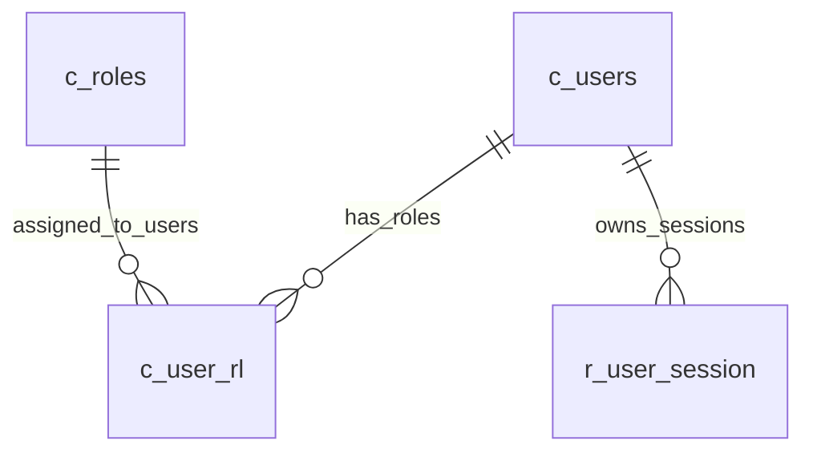

# 身份用户数据模型

本文回答“STDAS 的用户数据表怎么设计”。结论先行：**字段名优先参考 MES，保证语义一致；表范围按 STDAS 测试部门内部系统裁剪，不复制 MES 的完整权限、人事、岗位、证照和跨厂区治理体系。**

## 设计原则

- 表名和关键字段名尽量沿用 MES 语义，例如 `c_users`、`c_roles`、`c_user_rl`、`passwd`、`person_code`、`site_id`、`is_on_job`。
- 表集合只服务 STDAS 当前场景：登录、当前用户、最小角色、服务端 session。
- 不创建额外 PostgreSQL schema；migration 在数据库默认 search path 下创建表。
- `passwd` 只保存 Argon2id PHC hash，不保存明文密码。
- `r_user_session` 只保存 access token hash，不保存明文 token。
- MES 中更复杂的权限对象、功能点、组织层级、班别、岗位证照、审批链和接口同步表暂不落地；后续由真实需求触发。

## 当前表清单

| 表 | 类型 | 用途 | 是否参考 MES | STDAS 裁剪点 |
|----|------|------|--------------|--------------|
| `c_users` | 主数据 | 用户账号、显示名、员工号、默认站点、在职状态、系统管理员标记 | 高 | 保留登录和用户上下文需要的字段；不实现完整 HR 同步和复杂组织模型 |
| `c_roles` | 主数据 | 角色定义 | 中 | 先只支持本系统角色，不复制 MES 全量权限层级 |
| `c_user_rl` | 关系表 | 用户与角色多对多关系 | 高 | 保留用户角色关联，不扩展到权限点和菜单功能点 |
| `r_user_session` | 运行数据 | 登录 access session | 低到中 | STDAS 自有会话表；字段语义服务当前 Bearer token 登录链路 |

## `c_users`

一行表示一个可登录或可审计的用户账号。

| 字段 | 含义 | 当前使用方式 |
|------|------|--------------|
| `id` | 用户内部 ID，字符串 UUID | API 返回为 `user_id`，被 `c_user_rl` 和 `r_user_session` 引用 |
| `username` | 登录账号 | `POST /api/v1/auth/login` 使用 |
| `passwd` | 密码字段名沿用 MES，但内容为 Argon2id PHC hash | 登录时校验，不对前端返回 |
| `fname` | 显示名/名 | API 返回为 `display_name` 的优先来源 |
| `lname` | 姓/补充显示字段 | 当前保留，暂未参与登录逻辑 |
| `notes` | 备注 | 当前保留，后续用于管理员说明 |
| `schedule` | 班别/排程 | 当前保留，不实现班别权限 |
| `language` | 用户语言 | 当前保留，后续国际化可用 |
| `badge` | 厂牌/门禁或工牌标识 | 当前保留，不作为登录主键 |
| `site_id` | 默认站点/厂区 | API 返回；后续用于默认上下文 |
| `department` | 部门 | 当前保留，用于测试部门内部管理 |
| `is_system_reserved` | 系统保留账号标记，`Y/N` | bootstrap 管理员写为 `Y` |
| `is_system_manager` | 系统管理员标记，`Y/N` | API 返回为 `is_system_manager` |
| `person_code` | 员工号/人员编码 | API 返回；用于和 MES/人事编码对齐 |
| `creat_user` / `creat_date` | 创建人/创建时间 | 审计字段，保留 MES 拼写 |
| `lm_user` / `lm_date` | 最后修改人/最后修改时间 | 审计字段 |
| `leader_name` / `leader_emp_no` | 主管姓名/主管员工号 | 当前保留，暂不实现审批链 |
| `duty_name` | 职务/岗位 | 当前保留，暂不实现岗位权限 |
| `new_account_source` | 账号来源 | bootstrap 写为 `STDAS` |
| `is_on_job` | 在职状态，`Y/N` | 登录只允许 `Y` |
| `depart_date` | 离职时间 | `is_on_job='N'` 时可用 |
| `sync_failure_type` | 同步失败类型 | 当前保留，未来接入人事/MES 同步时再定义 |

## `c_roles`

一行表示一个 STDAS 内部角色。

| 字段 | 含义 | 当前使用方式 |
|------|------|--------------|
| `id` | 角色数字 ID | 全局唯一；`c_user_rl.role_id` 外键引用 |
| `site_id` | 角色所属站点 | 支持站点内角色命名 |
| `role_name` | 角色名 | bootstrap 使用 `STDAS_ADMIN` |
| `is_system_reserved` | 系统保留角色标记 | bootstrap 管理员角色写为 `Y` |
| `authorized_level` | 授权等级 | 当前只作为粗粒度等级字段 |
| `roles_uuid` | 角色 UUID/稳定编码 | 保留 MES 风格字段名 |
| `decentralization` | 是否分权 | 当前保留，不实现复杂分权 |
| `create_user` / `create_time` | 创建审计 | 审计字段 |
| `lm_user` / `lm_time` | 修改审计 | 审计字段 |

## `c_user_rl`

用户与角色的多对多关联表。

| 字段 | 含义 | 当前使用方式 |
|------|------|--------------|
| `user_id` | 用户 ID | 引用 `c_users.id` |
| `role_id` | 角色 ID | 外键引用 `c_roles.id` |
| `is_system_reserved` | 系统保留关联标记 | bootstrap 管理员关联写为 `Y` |
| `creat_user` / `creat_date` | 创建审计 | 审计字段，保留 MES 拼写 |
| `lm_user` / `lm_date` | 修改审计 | 审计字段 |

## `r_user_session`

服务端登录会话表。它不是 MES 用户表的完整复制，而是 STDAS 当前 Bearer token 登录链路需要的运行表。

| 字段 | 含义 | 当前使用方式 |
|------|------|--------------|
| `session_uuid` | 会话 ID | 每次登录生成 |
| `user_id` | 用户 ID | 引用 `c_users.id` |
| `access_token_hash` | access token 的 SHA-256 hash | `GET /api/v1/auth/me` 通过 Bearer token hash 查找 |
| `token_type` | token 类型 | 当前固定为 `Bearer` |
| `expires_at` | 过期时间 | 当前 access token 有效期 8 小时 |
| `is_revoked` | 是否撤销，`Y/N` | 后续 logout/refresh 使用 |
| `create_time` | 创建时间 | 登录时写入 |
| `revoked_time` | 撤销时间 | 后续 logout 使用 |

## 关系



## 当前刻意不做

- 不复制 MES 的完整 `permission/function/menu` 模型。
- 不做复杂厂区、客户、产品维度权限矩阵。
- 不做 HR 主数据全量同步表。
- 不做岗位证照、培训资质、班别排程的权限控制。
- 不把 role 当作前端可自由选择的登录上下文。

这些能力不是否定，而是等后续真实业务切片触发后再按模块扩展，避免测试部门内部工具被 MES 级复杂度拖垮。

## 初始化管理员

本地或部署数据库初始化管理员使用：

```powershell
cargo gateway-seed-dev-admin
```

默认流程会在终端交互式输入并确认密码；系统只把 Argon2id hash 写入 `c_users.passwd`，不保留明文密码文件。

环境变量密码只保留给临时自动化或 CI 场景：

```powershell
$env:STDAS_BOOTSTRAP_ADMIN_PASSWORD = "<password>"
cargo gateway-seed-dev-admin
```

可选变量：

```powershell
$env:STDAS_BOOTSTRAP_ADMIN_USERNAME = "admin"
$env:STDAS_BOOTSTRAP_ADMIN_DISPLAY_NAME = "STDAS Administrator"
$env:STDAS_BOOTSTRAP_ADMIN_PERSON_CODE = "admin"
$env:STDAS_BOOTSTRAP_ADMIN_SITE_ID = "STDAS"
```

初始化命令会先执行 migration，再 upsert `c_users`、`c_roles` 和 `c_user_rl`。密码不会写入 migration、代码、日志或本地文件。
